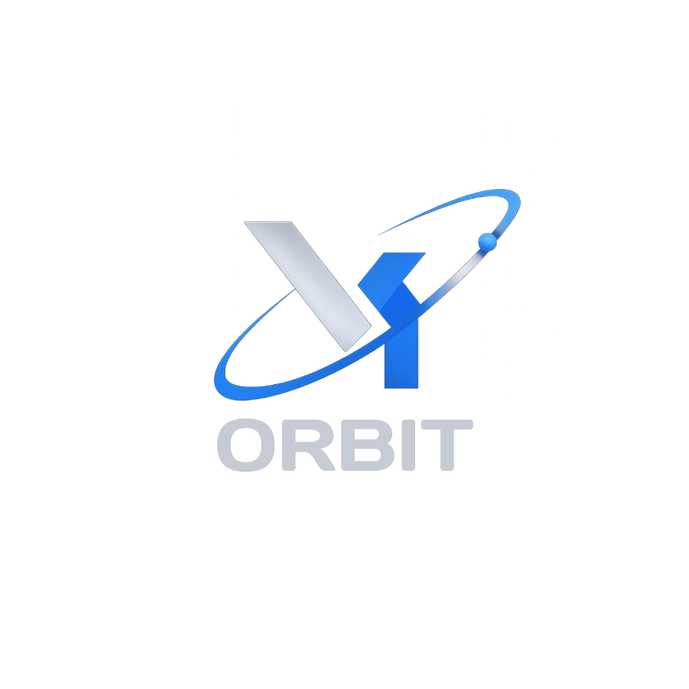

<!--
  Developed & Maintained by VY ORBIT (https://vyorbit.com)
  Internal ID: VYORBIT-DISCORD-WELCOMEPRO-V1
-->

> This repository contains all the resources used in VY Orbit
> all rights reserved copyright © 2026-2027.

<!-- PROJECT LOGO -->
<br />
<div align="center">
  <a href="https://vyorbit.com">
    
  </a>
  <p align="center">
    <strong>VY ORBIT</strong>
    <br />
    <br />
  </p>
</div>

<div align="center">

# 🚀 WelcomePro — Enterprise Discord Welcome & Utility Bot
*Powered by VY ORBIT*

[](https://discord.js.org/)
[](https://www.typescriptlang.org/)
[](https://www.sqlite.org/)
[](https://nodejs.org/)
[](https://opensource.org/licenses/MIT)

**Galaxy Welcome** is a production-grade, highly scalable Discord bot designed to serve Discord servers with high performance and zero external database costs. Built with TypeScript, Discord.js v14, high-performance local SQLite (`better-sqlite3`), and a hybrid cluster/sharding architecture.

---

</div>

## 🌟 Key Features

- 👋 **Welcome System**: Custom setup (`/welcome setup`), custom message placeholders (`{mention}`, `{user}`, `{server}`, `{count}`), custom embed colors, embed/plain text toggles, preview testing (`/welcome test`), and full config views.
- 🚪 **Leave System**: Custom setup (`/leave setup`), placeholder support, embed colors, toggleable modes, and preview testing (`/leave test`).
- 🛠 **Utilities**: `/ping` (live bot & WebSocket API latency metrics) and `/serverinfo` (server stats + live welcome/leave configurations).
- 👑 **Owner Controls**: `/owner-servers` cross-cluster global server tracking using `broadcastEval`.
- 🗄 **Zero-Cost SQLite Database**: Local, file-based database powered by `better-sqlite3` with WAL mode enabled.
- 🔀 **Hybrid Sharding & Clustering**: Powered by `discord-hybrid-sharding` for multi-process scaling.

---

## 🛠 Tech Stack & Architecture

- **Language**: [TypeScript](https://www.typescriptlang.org/) (Strict Mode)
- **Core Library**: [Discord.js v14](https://discord.js.org/)
- **Clustering & Sharding**: [`discord-hybrid-sharding`](https://www.npmjs.com/package/discord-hybrid-sharding)
- **Database**: High-speed, local file-based [SQLite](https://www.sqlite.org/) via [`better-sqlite3`](https://www.npmjs.com/package/better-sqlite3)
- **CI/CD**: GitHub Actions (`.github/workflows/build.yml`) for automated TypeScript build verification.

---

## 📁 Repository Structure

```
Galaxy Welcome Discord Bot/
├── .github/workflows/
│   └── build.yml           # CI workflow for building TypeScript code
├── dist/                   # Compiled JavaScript output (gitignored)
├── src/
│   ├── commands/           # Slash commands divided by category
│   │   ├── admin/          # /welcome and /leave configuration commands
│   │   ├── owner/          # Owner-only administrative commands
│   │   └── utilities/      # /ping and /serverinfo utility commands
│   ├── database/           # SQLite connection, schemas, and repositories
│   │   ├── repositories/   # Guild, Welcome, Leave, Giveaway & Poll repositories
│   │   ├── db.ts           # SQLite initialization & connection pool
│   │   └── tables.ts       # CREATE TABLE SQL schema definitions
│   ├── events/             # Discord event handlers (ready, interactionCreate, etc.)
│   ├── managers/           # Background process managers (GiveawayManager, etc.)
│   ├── structures/         # ExtendedClient, Command, and Event base classes
│   ├── utils/              # Helper utilities (duration parsers)
│   ├── bot.ts              # Cluster worker entry point
│   └── index.ts            # Sharding & Cluster Manager entry point
├── .env.example            # Environment variables template
├── features.md             # Complete feature specification & DB schema guide
├── package.json            # Dependencies & build scripts
├── start.bat               # One-click Windows startup script
└── tsconfig.json           # TypeScript configuration
```

---

## 🚀 Quick Start & Installation

### Prerequisites

- [Node.js v20+](https://nodejs.org/)
- A Discord Application with a Bot Token from the [Discord Developer Portal](https://discord.com/developers/applications)

### Setup Instructions

1. **Clone the Repository**
   ```bash
   git clone https://github.com/your-username/Galaxy-Welcome-Discord-Bot.git
   cd "Galaxy Welcome Discord Bot"
   ```

2. **Install Dependencies**
   ```bash
   npm install
   ```

3. **Configure Environment Variables**
   Create a `.env` file in the root directory:
   ```env
   BOT_TOKEN=your_discord_bot_token
   CLIENT_ID=your_discord_client_id
   OWNER_ID=your_discord_user_id
   ```

4. **Build & Run the Bot**

   - **Windows (One-Click)**:
     Double-click `start.bat` or run:
     ```cmd
     start.bat
     ```

   - **Manual (Development)**:
     ```bash
     npm run dev
     ```

   - **Manual (Production Build)**:
     ```bash
     npm run build
     npm run start
     ```

---

## 📜 Commands Overview

| Command | Category | Permission | Description |
| :--- | :--- | :--- | :--- |
| `/dashboard` | Settings | Administrator | Interactive panel to manage all server settings |
| `/welcome setup` | Welcome | Administrator | Configure welcome channel, messages, and cards |
| `/leave setup` | Leave | Administrator | Configure leave notifications |
| `/autorole add` | AutoRole | Administrator | Set up automatic role assignment for new members |
| `/poll create` | Polls | Administrator | Start a new single/multiple choice poll |
| `/giveaway create` | Giveaways | Administrator | Launch a giveaway with custom entry rules |
| `/announce` | Announcements | Administrator | Create and schedule custom embed announcements |
| `/backup create` | Backup | Administrator | Create a restore point of all server settings |
| `/ping` | Utility | Everyone | Check bot and Discord API latency |
| `/owner-servers` | Owner | Bot Owner | View global server statistics across all shards |

---

## 🛡 Security & Best Practices

- **Token Protection**: All sensitive tokens and URIs are loaded exclusively from `.env`. Never commit your `.env` file to source control.
- **Isolated Server Data**: Server settings are completely isolated per Guild ID in MongoDB Atlas to ensure security and prevent data corruption during bot updates.
- **Permission Checking**: Commands strictly validate Discord permission flags before executing administrative actions.

---

## 📄 License

Distributed under the MIT License. See `LICENSE` for more information.

---

<div align="center">
Developed with ❤️ for large Discord communities.<br />
<strong>Copyright © 2026-2027 VY ORBIT. All rights reserved.</strong>
</div>
